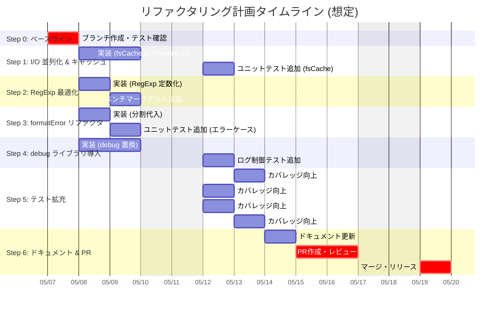

# リファクタリング計画書 v1.0

## 1. 目的

`generate-prompt.js` のパフォーマンスと保守性を、既存テストを維持しつつ段階的に向上させる。

## 2. 主要な改善点

*   ファイル読み込みの並列化とキャッシュ導入 (`Promise.all`, `Map`)
*   正規表現の事前コンパイルによる効率化
*   エラーハンドリングの簡素化 (分割代入)
*   ログ出力の `debug` ライブラリへの統一

## 3. 進め方

*   各ステップを独立したコミットとして管理 (Conventional Commits 形式)
*   各ステップ完了後に `npm test` を実行し、テストがすべてパスすることを確認
*   新規・変更箇所に対するユニットテストを追加し、カバレッジを維持・向上
*   最終的にドキュメントを更新し、Pull Request を作成

## 4. 視覚的な計画

### タイムライン (Gantt チャート)



### ステップ依存関係 (フローチャート)

```mermaid
graph TD
    subgraph "前提"
        A[現状コード] --> B(Step 0: ブランチ作成 & テスト緑確認);
    end

    subgraph "並列改修タスク"
        B --> C(Step 1: I/O 並列化 & キャッシュ);
        B --> D(Step 2: RegExp 最適化);
        B --> E(Step 3: formatError リファクタ);
        B --> F(Step 4: debug ライブラリ導入);
    end

    subgraph "テスト & ドキュメント"
        C --> G(Step 5: テスト拡充 - fsCache);
        D --> H(Step 5: テスト拡充 - RegExp);
        E --> I(Step 5: テスト拡充 - formatError);
        F --> J(Step 5: テスト拡充 - debug);
        G & H & I & J --> K(Step 6: ドキュメント更新);
    end

    subgraph "完了プロセス"
        K --> L(PR作成 & レビュー);
        L --> M(マージ & リリース);
    end

    style B fill:#f9f,stroke:#333,stroke-width:2px
    style L fill:#ccf,stroke:#333,stroke-width:2px
    style M fill:#cfc,stroke:#333,stroke-width:2px